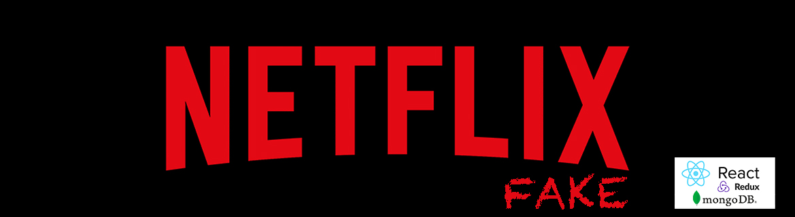

# App NETFLIX fake
_Este proyecto consiste en la creación de una applicación tratando de emular la aplicación original de Netflix, donde el usuario, en lugar de ver una pelicula en streaming, podrá solicitar su alquiler._

## Comenzando 🚀

_Para poder poner en funcionamiento el proyecto en tu máquina local con propositos de desarrollo y pruebas necesitarás instalar las siguiente dependencias:_

```
npm init -y
npm i sass react-router-dom axios dayjs antd react-redux react-slick slick-carousel

```
_Para ejecutar el programa en tu maquina local:_

```
npm start

```

### Components 📌
- /Header:
    - Este componente muestra las opciones de menú estandar una vez el usuario se logea.
    
- /MostrarCarrousel:
    - Este componente muestra las peliculas en un carrusel dinámico, con las opciones de alquilar y ampliar información en cada pelicula.

- /MostrarPeliculas:
    - Este componente muestra las peliculas en un formato cuadricula, donde cada pelicula tendrá la opción de ampliar su información que se desplegará en una ventana emergente, permitiendo la opción de alquilar dicha pelicula.

- /SearchBar:
    - Es la zona donde introducimos la pelicula que se quiera buscar por su titulo. En el momento que se escriba en este espacio, irán apareciendo las peliculas que coinciden con lo escrito, dando la opción de alquilar.

### Containers 📌
- /Admin:
    - Esta vista se activa en el Header automáticamente cuando el usuario logeado tiene el rol "admin". En esta vista, podrá visualizar todos los pedidos de todos los usuarios.

- /Home:
    - Esta vista es la pantalla principal de la App. Permite registrar un usuario nuevo introduciendo su email en la barra principal, y si este mail ya esta registrado, accede a la vista Login.

- /Homepage:
    - Esta vista que aparece cuando un usuario se logea. Será la vista principal donde el usuario podrá alquilar peliculas o acceder a determinados menus de peliculas determinados por el genero, popularidad, infantil, etc...

- /Login:
    - En esta vista el usuario introduce sus credenciales para acceder a Homepage donde podrá alquilar peliculas o revisar sus pedidos.

- /Profile:
    - Es la vista donde el usuario podrá acceder para revisar los pedidos realizados y sus datos de contacto.

- /Register:
    - Desde esta vista el usuario que no este registrado podrá realizarlo introduciendo sus datos.

## DEMO

* [GIF](https://recordit.co/pCkwnzRHDT)

## Ejecutando las pruebas 🚀

* [NETLIFY](https://fake-netflix-f.netlify.app/)


## Construido con 🛠️

_Tecnologías utilizadas en el proyecto_

- Javascript
- NodeJS
- React
- Redux
- Netlify
- Git
- GitHub
- GitFlow
* [Backend](https://github.com/RosaSabater/fake-netflix-b)
## Autores ✒️

* **Javier García**  - [javigarcias](https://github.com/javigarcias)
* **Rosa Sabater**  - [rosasabater](https://github.com/RosaSabater)
* **Pablo Antonini**  - [antonini333](https://github.com/Antonini333)

* [TABLERO TRELLO](https://trello.com/b/8T6U3vMQ)

---
